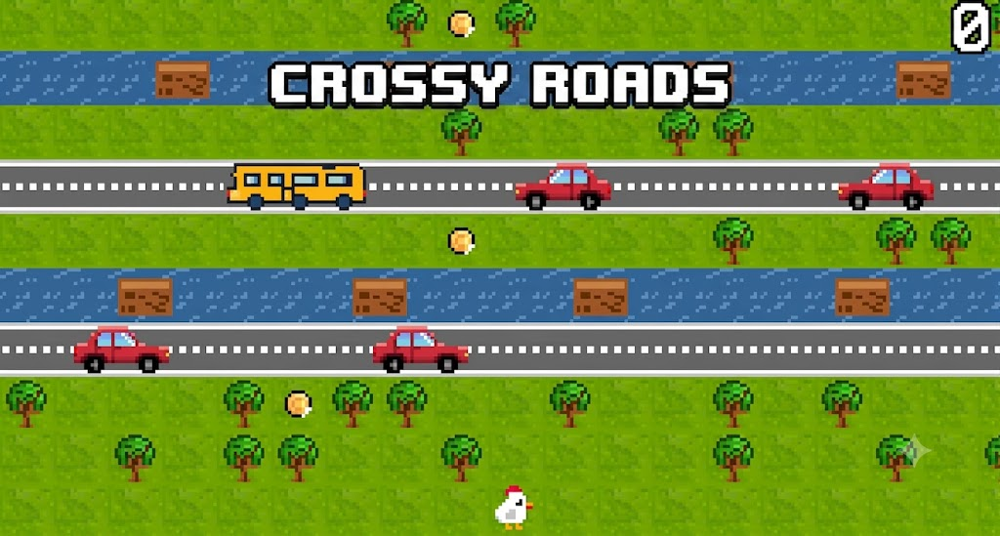

# CROSSY ROADS

<p align="center">
  
</p>


## Game Description

Crossy Roads is an endless arcade hopper game where you guide a character across busy roads and rivers while avoiding various obstacles. Your goal is to travel as far as possible without getting hit by vehicles or falling into the water.
As you progress, the difficulty increases with faster-moving traffic and more challenging patterns.

This project was developed by myself and João Barros (up202406502@edu.fe.up.pt) for the Laboratório de Desenho e Teste de Software (LDTS) course, FEUP, 2025-26.

For a more detailed version of this report click [here](./docs/README.md).

> This repository is a personal mirror (with full commit history preserved) of the original group submission on the FEUP Repo.

## Tech Stack

- **Language:** Java 17
- **Build tool:** Gradle
- **Terminal UI:** [Lanterna](https://github.com/mabe02/lanterna) for the console-based graphical interface
- **Testing:** JUnit 5 and Mockito for unit tests
- **Coverage:** JaCoCo for test coverage reports
- **Mutation testing:** [Pitest](https://pitest.org/) targeting core game logic, controllers and state classes
- **Architecture:** MVC (Model-View-Controller), organized into `model`, `view`, `controller`, `states` and `application` packages

## Setup Instructions

### Prerequisites
- Java 17+ (JDK)
- No local Gradle install needed — the project ships with the Gradle wrapper

### Running the game
```bash
git clone https://github.com/<your-username>/project-t02g03.git
cd project-t02g03
./gradlew run
```
On Windows, use `gradlew.bat run` instead.

### Running tests
```bash
./gradlew test
```

### Generating coverage / mutation reports
```bash
./gradlew jacocoTestReport   # HTML report in build/reports/jacoco
./gradlew pitest             # HTML report in build/reports/pitest
```

## My Contribution

 My focus was mainly on the **model, view and controller layers** of the game — the core game logic, entity behavior, and the Lanterna-based rendering — as well as the game states and application entry point. The group was small, therefore work was required in basically all aspects that developing this game required. 


## Screenshots

The following images show the different menus, as well as in-game features in-depth. 
<p align="center" justify="center">
  
</p>
<p align="center">
  <b><i>Fig 1. User Selection</i></b>
</p>  

<br>
<br />

<p align="center" justify="center">
  
</p>
<p align="center">
  <b><i>Fig 2. Main Menu</i></b>
</p>  

<br>
<br />

<p align="center" justify="center">
  
</p>
<p align="center">
  <b><i>Fig 3. Current User Stats</i></b>
  <p align="center">
  <i>Located at top right of Main Menu</i>
</p>  

<br>
<br />

<p align="center" justify="center">
  
</p>
<p align="center">
  <b><i>Fig 4. GamePlay Screenshot</i></b>
</p>  

<br>
<br />

<p align="center" justify="center">
  
</p>
<p align="center">
  <b><i>Fig 5. Game Over Screen</i></b>
</p>  

<br>
<br />

<table align="center">
  <tr>
    <td></td>
    <td></td>
  </tr>
  <tr>
    <td></td>
    <td></td>
  </tr>
</table>
<p align="center">
  <b><i>Fig 6. Shop Interface (Unlocked, Selected, and Locked Skins)</i></b>
</p>

<br>
<br />

<p align="center" justify="center">
  
</p>
<p align="center">
  <b><i>GIF 1. Death Animation</i></b>
</p>