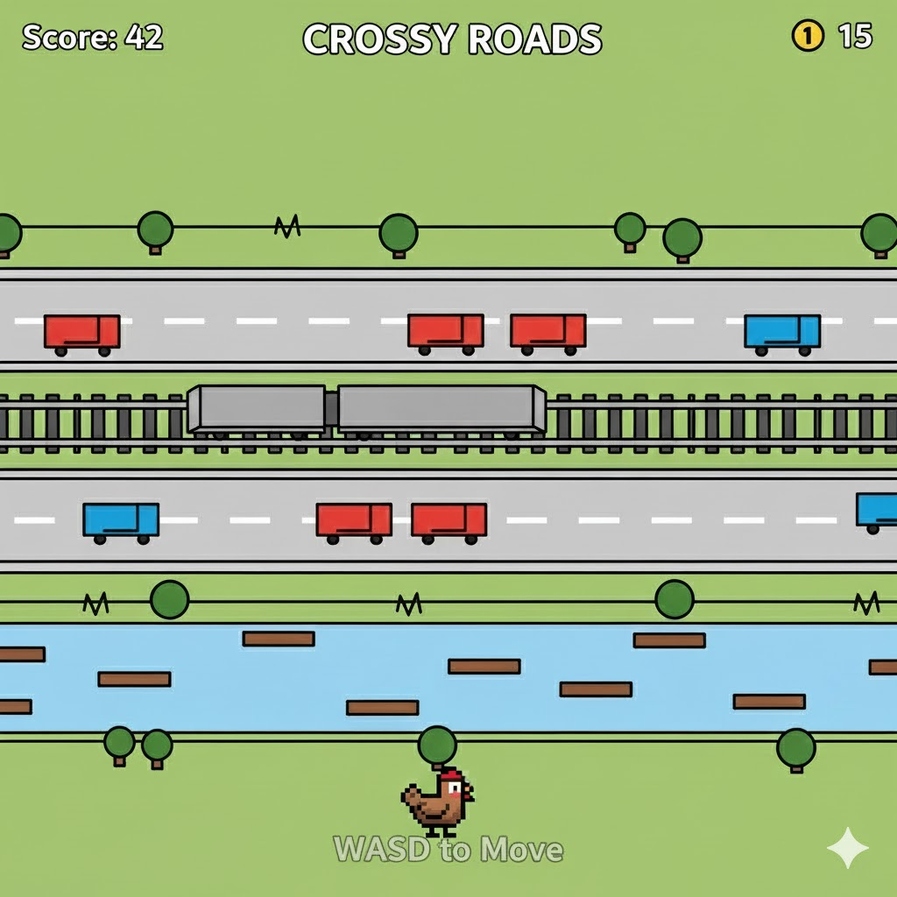
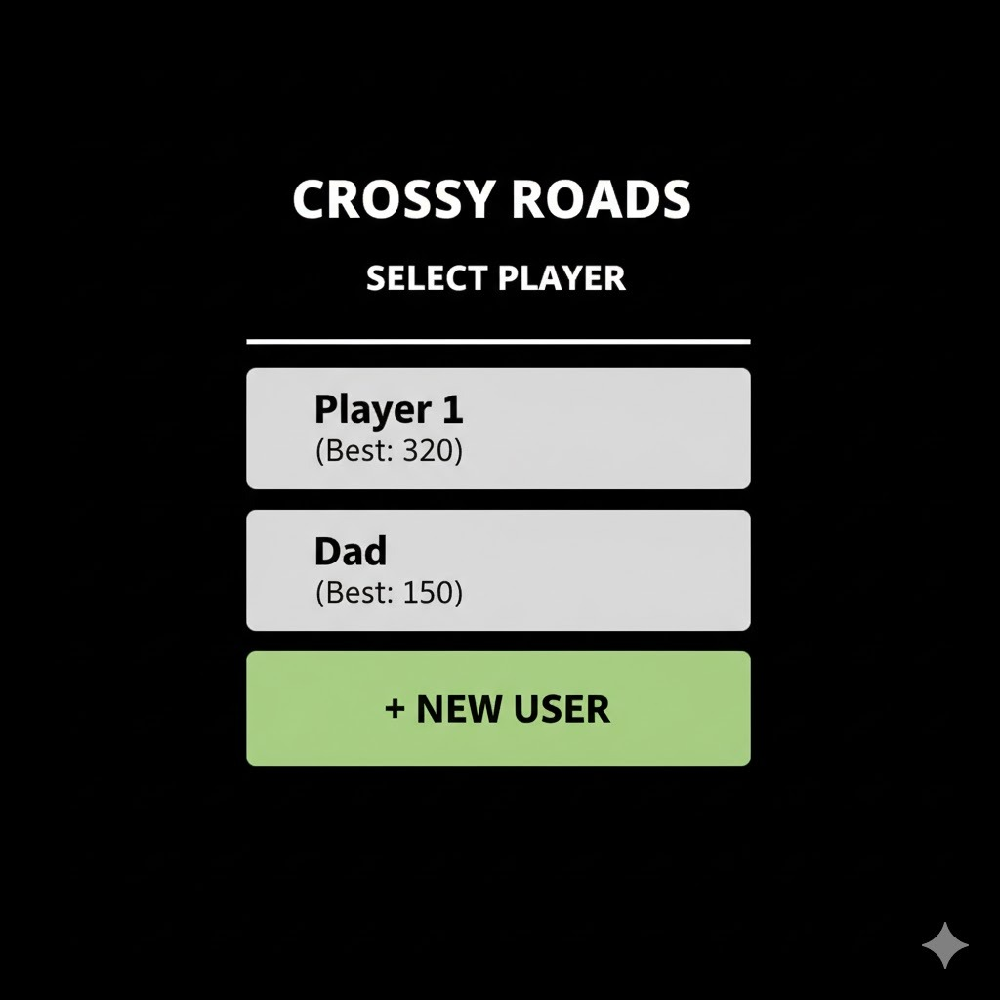
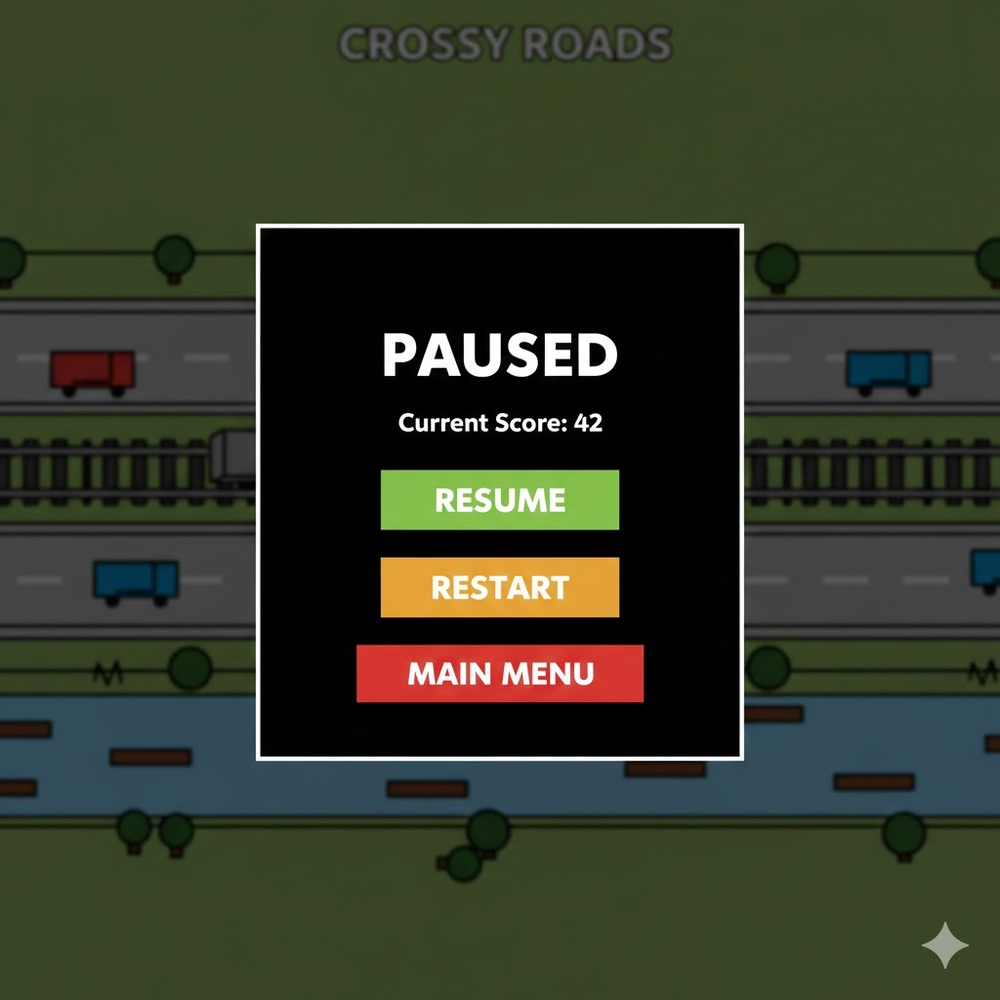

# LDTS_T02_G03 - CROSSY ROADS

## Game Description
Crossy Roads is an endless arcade hopper game where you guide a character across busy roads, train tracks, and rivers while avoiding various obstacles. Your goal is to travel as far as possible without getting hit by vehicles, trains, or falling into the water.
As you progress, the difficulty increases with faster-moving traffic and more challenging patterns.

## Authors
- João Barros (up202406502@edu.fe.up.pt)
- Miguel Rocha (up202405484@edu.fe.up.pt)
- Rosa Chilengue (up202109257@edu.fe.up.pt)

### Game preview

  

  <b><i>Fig 1. Game Screen</i></b>

  

 
 

### Menus

  

  <b><i>Fig 2. Main Menu</i></b>

  

  

  <b><i>Fig 3. User Selection Menu</i></b>

  

  

  <b><i>Fig 4. Pause Menu</i></b>

  

### End Game

  

  <b><i>Fig 5. Game Over</i></b>

  

### Controls
- **W**: Move Forward
- **S**: Move Backward
- **A**: Move Left
- **D**: Move Right
- **Q / ESC**: Quit Game

### Report

More information regarding the actual development of the game and the final report can be found in the [Project Report](docs/README.md).