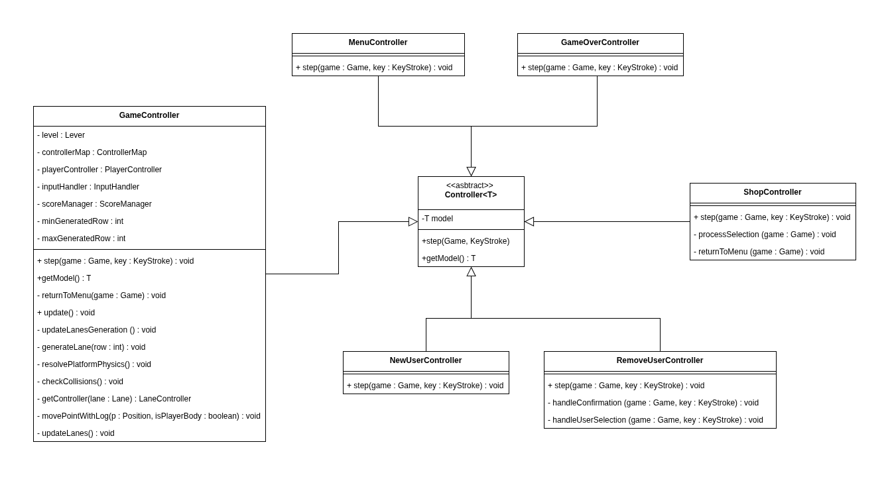
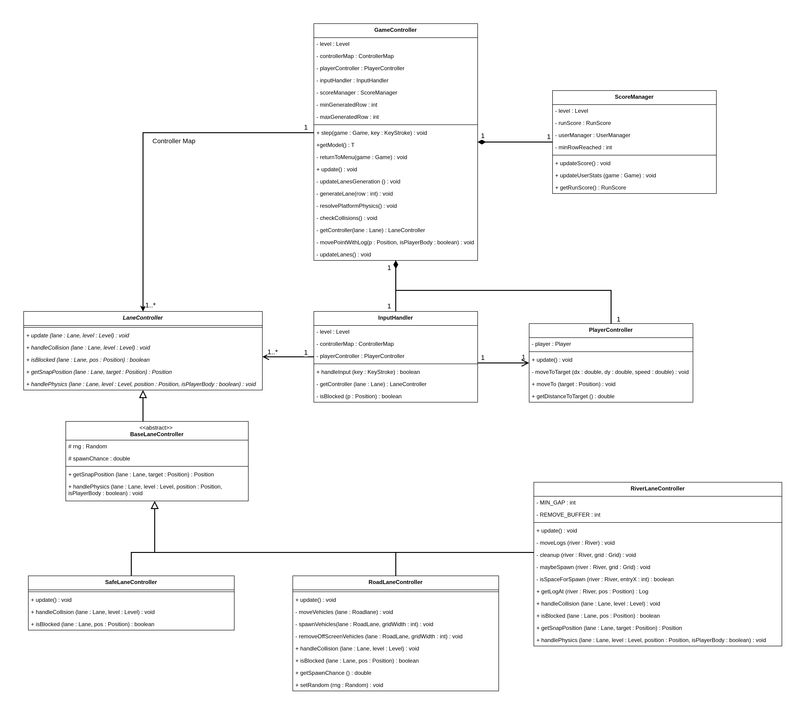
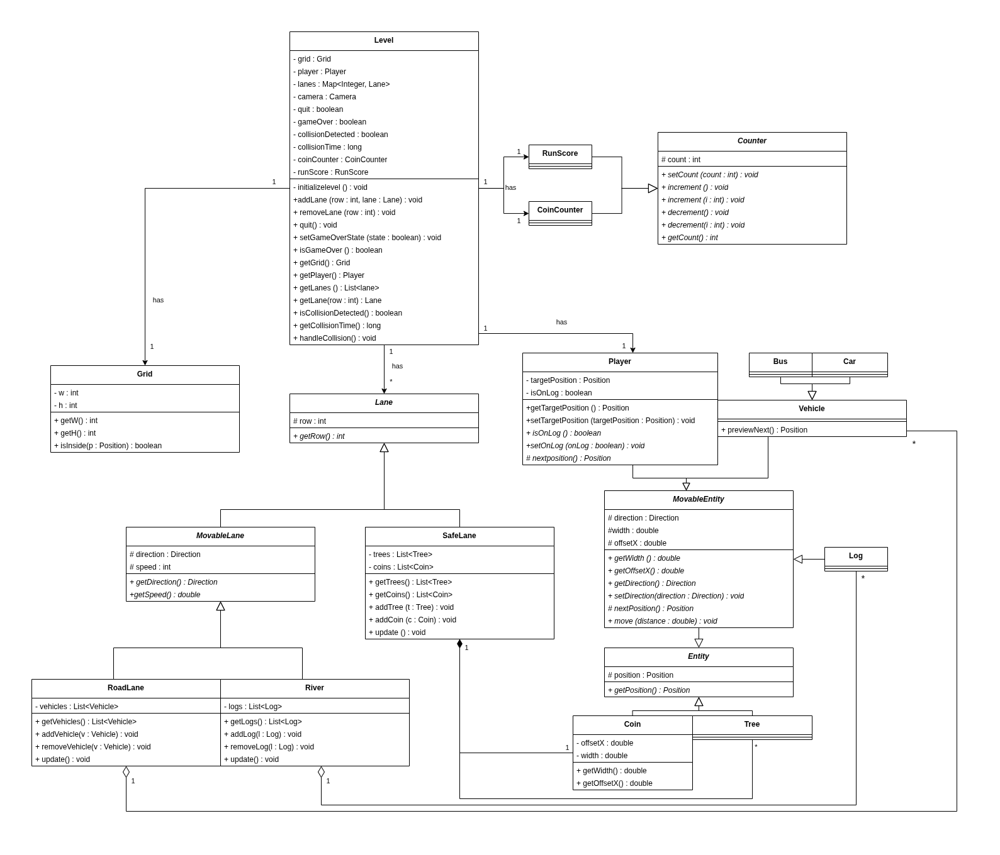
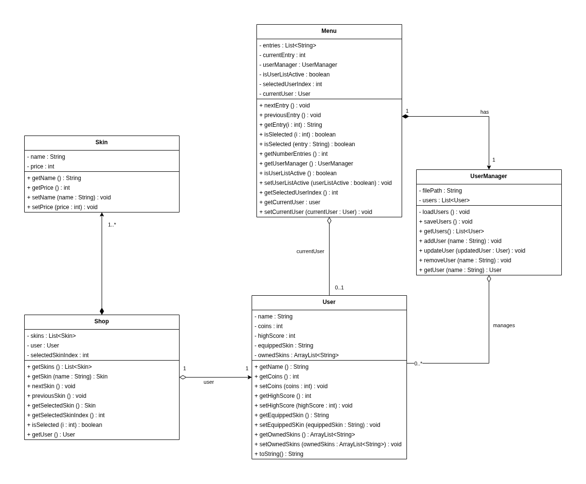
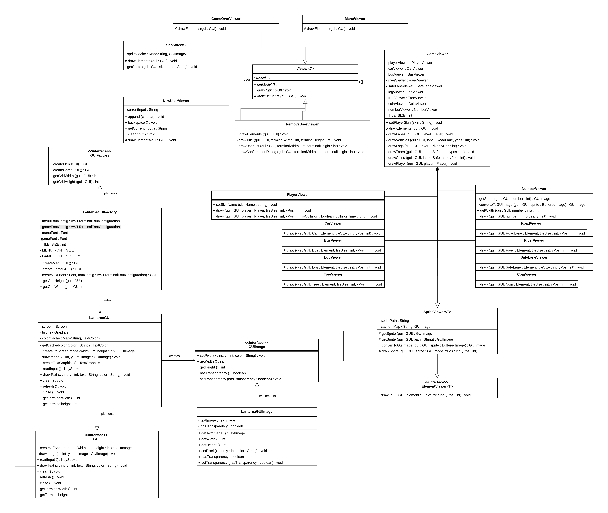

# LDTS_T02_G03 - CROSSY ROADS

## Game Description

Crossy Roads is an endless arcade hopper game where you guide a character across busy roads and rivers while avoiding various obstacles. Your goal is to travel as far as possible without getting hit by vehicles or falling into the water.
As you progress, the difficulty increases with faster-moving traffic and more challenging patterns.

This project was developed by João Barros (up202406502@edu.fe.up.pt), Miguel Rocha (up202405484@edu.fe.up.pt) and Rosa Chilengue (up202109257@edu.fe.up.pt) for LDTS 2025-26.

## Implemented Features

- **Keyboard control** - The keyboard inputs are received through the respective events and interpreted according to the current game state. 
- **Player control** - The player moves using the keyboard. (WASD)
- **Collision detection** - Collisions between player and car objects are verified.
- **Lanes** - The game has different lanes, each one with different types of entities.
- **Animations** - Several animations are incorporated in the game, like the character dying, the character changing direction (sprite) with input and the "glowing" of coins.
- **Score** - Each run will have a score, storing the highest score upon death.
- **Multiple users** - The game supports multiple users, each one with their own highest score and their coins.
- **Shop interaction and coins** - With coins earned throught the gameplay, each user is able to buy new skins for the character in the in-game shop.
- **Connected Menus** - The user has the ability to browse through the different menus; most of them are connected to the main menu, like the Shop, User Selection, and GameOver Menu.
- **Camera** - To allow for infinite gameplay, a camera was implemented, that follows the player upwards while keeping smooth movement. The camera also holds the "lower boundary" of the game, ensuring movement upwards and not downwards. 
- **Increase of difficulty** - As the game goes on, the difficulty increases -> every entity moves progressively faster. 

## Planned Features
All planned features were either implemented, or a decision was made against implementing them as justified below
## Not Implemented Features

- **Buttons** - Functional and interactive buttons. Reason: A keyboard-focused navigation system for menus proved to be easier to implement and user-friendly enough so that it was not necessary to implement buttons.
- **Mouse control** - The mouse inputs will be received through the respective events and interpreted according to the current game state. Reason: Same as above.

## Game Preview

The following images show the different menus, as well as in-game features in-depth. 

  

  <b><i>Fig 1. User Selection</i></b>

  

 
 

  

  <b><i>Fig 2. Main Menu</i></b>

  

 

 

  

  <b><i>Fig 3. Current User Stats</i></b>
  

  <i>Located at top right of Main Menu</i>

  

 

 

  

  <b><i>Fig 4. GamePlay Screenshot</i></b>

  

 

 

  

  <b><i>Fig 5. Game Over Screen</i></b>

  

 
 

<table align="center">
  <tr>
    <td></td>
    <td></td>
  </tr>
  <tr>
    <td></td>
    <td></td>
  </tr>
</table>

  <b><i>Fig 6. Shop Interface (Unlocked, Selected, and Locked Skins)</i></b>

 
 

  

  <b><i>GIF 1. Death Animation</i></b>

## Design

### General Structure
#### Problem in Context:

Following the given recommendations, the project follows an MVC architecture, which divides the game in three parts, which store the logic and data (model), the visual effects (view) and the control of the game (controller).

#### The Pattern:
As described before, regarding the "Architectural Pattern", the project follows the Model-View-Controller style. This ensures the concerns are separate: 
- **Model**: stores the logic and data. Completely independent of user interface.
- **View**: Handles visualization. Reads from model and draws to screen using implemented GUI.
- **Controller**: Processes input and dictates the flow of the game.

#### Controller Implementation:
The Controller package is responsible for handling user input and updating the game state. It acts as the bridge between the Model and the View. The main classes of this package do the following: 
- **GameController**: The central controller for the gameplay state. It orchestrates the game loop, managing the player's movement, lane generation, collision detection, and score updates. It delegates specific tasks to specialized sub-controllers.
- **LaneController**: An interface for handling logic specific to different types of lanes.
- **PlayerController**: Dedicated to handling player-specific logic, such as movement validation and position updates based on keyboard input.
- **MenuController**: Manages navigation and interaction within the various menu screens (Main Menu, Shop, Game Over), allowing users to select options and switch states.

This structure ensures that the game logic is modular and that input handling is separated from the core game rules. 

### Main Controllers in the package

  

  <b><i>Fig 7. Main controllers</i></b>

  

  <b><i>Fig 8. Main Game Controller</i></b>

#### Model Package UML Design Decisions

The Model package is split into two domains: **Game** (gameplay entities) and **Menu** (user interface data). To keep them understable / maintain relevancy, we decided to remove from the UMLs:

- **Position and Direction**: Used by almost every game entity. Including them would clutter the UML and make it less readable.
- **GameOver and RemoveUser**: These classes are just to help the state, and have no relevant relationships to other model classes. `GameOver` is standalone, and `RemoveUser` is a thin wrapper around Menu.

The **Game Model** also holds a camera, to make sure the entities are drawn in their correct locations - a helper to the viewer.

### Game Model UML

  

  <b><i>Fig 9. Game Model</i></b>

 

### Menu Model UML

  

  <b><i>Fig 10. Menu Model</i></b>

### View Package

The View component separates the game's visual logic from the rendering library through a layered architecture:

#### GUI Abstraction
- **`GUI` Interface**: Abstracts all graphical operations (`drawText`, `clear`, `refresh`), ensuring the application doesn't depend on a specific library - following SOLID's Dependency Inversion Principle.
- **`LanternaGUI`**: Implementation of Lanterna.

#### Viewer Hierarchy
- **`Viewer<T>`**: Abstract base class holding a model reference and defining `draw(GUI gui)`. Each `State<T>` holds a corresponding `Viewer<T>`.
- **Game Viewers** (`view.game`): `GameViewer` orchestrates all gameplay rendering; `SpriteViewer<T>` provides sprite-based rendering with caching.
- **Menu Viewers** (`view.menu`): `MenuViewer`, `GameOverViewer`, `ShopViewer`, `NewUserViewer`, `RemoveUserViewer`

#### Benefits
- **Interchangeability**: Lanterna can be replaced by implementing a new `GUI`, without modifying viewers.
- **Testability**: Viewers can be tested by mocking the `GUI` interface.
- **Modularity**: New visuals are added by creating new Viewer classes.

### View Package UML

  

  <b><i>Fig 11. View package</i></b>

## Design Patterns

This section details the main design patterns used throughout the project, explaining the problem each one solves and how it was implemented.

---

### 1. State Pattern

#### Problem in Context
The game has multiple states (Main Menu and its options, and the main Gameplay), with different behaviours and input handling. Managing these with conditionals would lead to complex, hard-to-maintain code. The fact that text would also require sprites, or become almost unreadable due to the font of the main game, we proceeded with the State Pattern, also to allow different terminals to have different GUIs.

#### The Pattern
"The **State Pattern** allows an object to alter its behavior when its internal state changes. The object will appear to change its class".

#### Implementation
- **`State<T>`**: Abstract base class that encapsulates a model, viewer, and controller (MVC architecture, as mentioned previously)
- **Concrete States**: `MenuState`, `GameState`, `ShopState`, `GameOverState`, `NewUserState`, `RemoveUserState`
- **Context**: The `Game` class holds the current `State<?>` and delegates `step()` calls to it

#### Consequences
- **Encapsulation**: Each state manages its own behavior completely
- **Extensibility**: New screens/ states can easily be added.
- **Flexibility**: Different GUIs can be used for different states.

### 2. Factory Method Pattern

#### Problem in Context
The game needs different GUI configurations for menus (larger font) and gameplay (smaller font for pixel graphics). Creating these directly would couple the application to specific implementation details.

#### The Pattern
"The **Factory Method** pattern defines an interface for creating objects, but lets subclasses decide which classes to instantiate".

#### Implementation
- **`GUIFactory`**: Interface defining `createMenuGUI()` and `createGameGUI()`
- **`LanternaGUIFactory`**: Concrete factory that creates `LanternaGUI` instances with appropriate font configurations

#### Consequences
- **Abstraction**: The `Game` class doesn't know about Lanterna specifics
- **Flexibility**: Different GUI implementations can be swapped by changing the factory, keeping an easy to change design. 

---

### 3. Template Method Pattern

#### Problem in Context
All viewers need to follow the same drawing sequence (clear screen -> draw elements in the buffer -> refresh), but each viewer draws different elements. Duplicating this logic would generate lots of code, making it hard to maintain.

#### The Pattern
The **Template Method** defines the skeleton of an algorithm in a base class, letting subclasses override specific steps without changing the algorithm's structure.

#### Implementation
- **`Viewer<T>`**: Defines the template method `draw(GUI gui)` with the fixed sequence
- **`drawElements(GUI gui)`**: Abstract method that subclasses implement

#### Consequences
- **Code reuse**: Common algorithm defined once in base class
- **Consistency**: All viewers follow the same rendering lifecycle
- **Extensibility**: New viewers only implement `drawElements()`

---

### 4. Strategy Pattern

#### Problem in Context
Different lanes have different physics and collision handling, so it is determined at run-time which strategy to use.

#### The Pattern
"The **Strategy Pattern** defines a family of algorithms, encapsulates each one, and makes them interchangeable".

#### Implementation
- **`LaneController`**: Interface defining lane behavior (`update()`, `handleCollision()`, `isBlocked()`, `handlePhysics()`)
- **`BaseLaneController`**: Abstract base class with common functionality
- **Concrete Strategies**: `RoadLaneController`, `RiverController`, `SafeLaneController`

The `GameController` uses the appropriate controller based on lane type, allowing each lane to have its own update and collision logic.

#### Consequences
- **Separation of concerns**: Each lane type's logic is isolated
- **Open/Closed Principle**: New lane types can be added without modifying existing code

---

### 5. Composite Pattern
#### Problem in Context
The game has many related entities (Cars and Buses are Vehicles, Rivers and Roads are Lanes) that share common properties but have distinct behaviors. Without proper structuring, this leads to code duplication.

#### The Pattern
The **Composite Pattern** and inheritance hierarchies allow treating individual objects and compositions uniformly, while enabling shared behavior through base classes.

#### Implementation
**Lane Hierarchy:**
- `Lane` (abstract)
  - `RoadLane`
  - `River`
  - `SafeLane`

**Vehicle Hierarchy:**
- `Vehicle` (abstract)
  - `Car`
  - `Bus`

**Viewer Hierarchy:**
- `SpriteViewer<T>` (abstract, implements `ElementViewer<T>`)
  - `PlayerViewer`
  - `CarViewer`
  - `BusViewer`
  - `LogViewer`
  - `TreeViewer`
  - `CoinViewer`
  - `RoadViewer`
  - `RiverViewer`
  - `SafeLaneViewer`

#### Consequences
- **Code reuse**: Common attributes (position, size) defined in base classes
- **Polymorphism**; 
- **Extensibility**;

---

### 6. Update Method Pattern

#### Problem in Context
The game has many entities (player, vehicles, logs, camera) that need to update their state each frame. Without a unified approach, the game loop would need to know the specific update logic for each entity type, leading to tightly coupled and hard-to-maintain code.

#### The Pattern
"The **Update Method** pattern simulates a collection of independent objects by telling each to process one frame of behavior at a time".

#### Implementation
- **`GameController.update()`**: Calls `update()` on all entities

#### Consequences
- **Encapsulation**: Each entity manages its own per-frame behavior
- **Decoupling**: The game loop doesn't need to know entity-specific update logic
- **Open/Closed**: New entity types can easily be added

---

### 7. Flyweight Pattern

#### Problem in Context
Lanterna drawing isn't very efficient, and there are many sprites in the game, leading to a laggy gameplay.

#### The Pattern
"The **Flyweight Pattern** uses sharing to support large numbers of fine-grained objects efficiently". 

#### Implementation
- **`SpriteViewer.cache`**: A static `Map<String, GUIImage>` that stores loaded sprites by their file path
- **`getSprite(GUI gui, String path)`**: Checks the cache before loading; returns cached sprite if available
- **`LanternaGUI.colorCache`**: A `Map<String, TextColor>` that caches parsed colors

The sprite cache is shared across all viewer instances, ensuring each image is loaded only once regardless of how many entities use it, improving performance.

#### Consequences
- **Memory efficiency**: Sprites are loaded once and shared across all instances
- **Performance**: Eliminates redundant file I/O and image processing
---

## Known-code smells

Currently the input needs to be done 1 character at a time, and needs "enter" to be pressed to be registered. The view testing is also very basic, as it only tests the console viewer. Using Lanterna in the future will allow for a better input experience, and a more advanced testing system.

There is also the presence of hardcoded values, such as the size of the grid, RoadLanes spawnChance and offset values and more. This is something that will be changed in the future, when logic for increasing difficulty is implemented and the size of different entities is taken into account.
## Testing

### Screenshot of coverage report

  

  <b><i>Fig 12. Code coverage screenshot</i></b>

## Self-evaluation

The work was divided in a way that felt fair to every member.
Therefore:

- João Barros: 33.3%
- Miguel Rocha: 33.3%
- Rosa Chilengue: 33.3%