# LDTS_T02_G03 - CROSSY ROADS

## Game Description

Crossy Roads is an endless arcade hopper game where you guide a character across busy roads and rivers while avoiding various obstacles. Your goal is to travel as far as possible without getting hit by vehicles or falling into the water.
As you progress, the difficulty increases with faster-moving traffic and more challenging patterns.

This project was developed by João Barros (up202406502@edu.fe.up.pt), Miguel Rocha (up202405484@edu.fe.up.pt) and Rosa Chilengue (up202109257@edu.fe.up.pt) for LDTS 2025-26.

## Implemented Features

- **Keyboard control** - The keyboard inputs are received through the respective events and interpreted according to the current game state. 
- **Player control** - The player moves using the keyboard. (WASD)
- **Collision detection** - Collisions between player and car objects are verified.
- **Lanes** - The game has different lanes, each one with different types of entities.
- **Animations** - Several animations are incorporated in the game, like the character dying, the character changing direction (sprite) with input and the "glowing" of coins.
- **Score** - Each run will have a score, storing the highest score upon death.
- **Multiple users** - The game supports multiple users, each one with their own highest score and their coins.
- **Shop interaction and coins** - With coins earned throught the gameplay, each user is able to buy new skins for the character in the in-game shop.
- **Connected Menus** - The user has the ability to browse through the different menus; most of them are connected to the main menu, like the Shop, User Selection, and GameOver Menu.
- **Camera** - To allow for infinite gameplay, a camera was implemented, that follows the player upwards while keeping smooth movement. The camera also holds the "lower boundary" of the game, ensuring movement upwards and not downwards. 
- **Increase of difficulty** - As the game goes on, the difficulty increases -> every entity moves progressively faster. 

## Planned Features
All planned features were either implemented, or a decision was made against implementing them as justified below
## Not Implemented Features

- **Buttons** - Functional and interactive buttons. Reason: A keyboard-focused navigation system for menus proved to be easier to implement and user-friendly enough so that it was not necessary to implement buttons.
- **Mouse control** - The mouse inputs will be received through the respective events and interpreted according to the current game state. Reason: Same as above.

## Game Preview

The following images show the different menus, as well as in-game features in-depth. 

  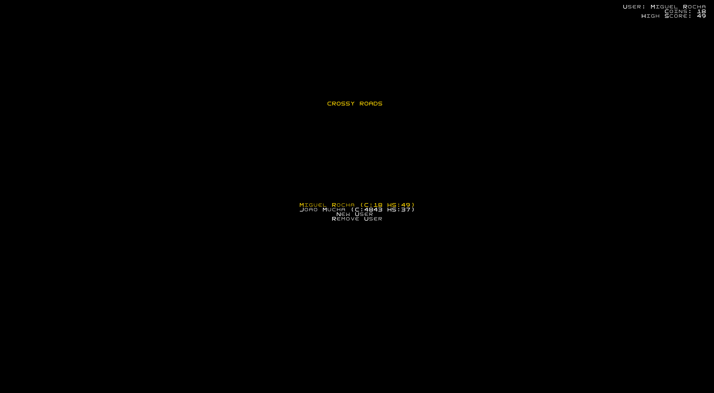

  <b><i>Fig 1. User Selection</i></b>

  

 
 

  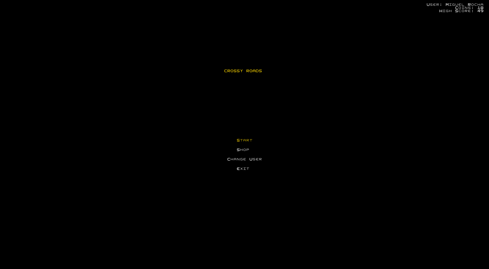

  <b><i>Fig 2. Main Menu</i></b>

  

 

 

  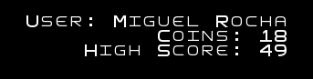

  <b><i>Fig 3. Current User Stats</i></b>
  

  <i>Located at top right of Main Menu</i>

  

 

 

  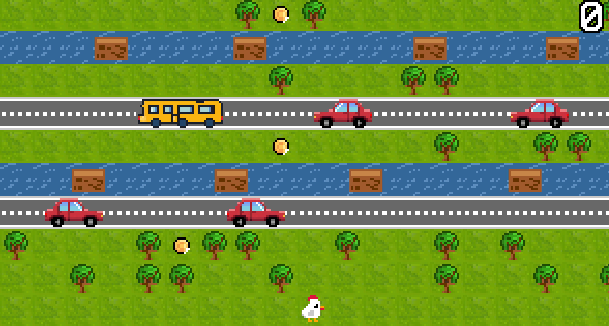

  <b><i>Fig 4. GamePlay Screenshot</i></b>

  

 

 

  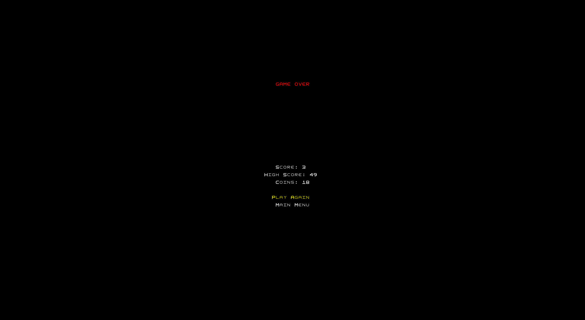

  <b><i>Fig 5. Game Over Screen</i></b>

  

 
 

<table align="center">
  <tr>
    <td>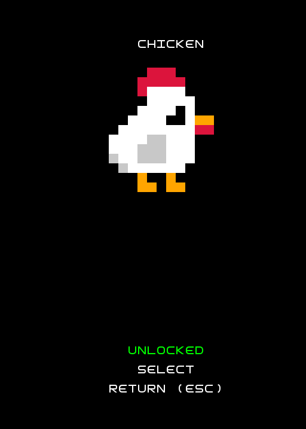</td>
    <td>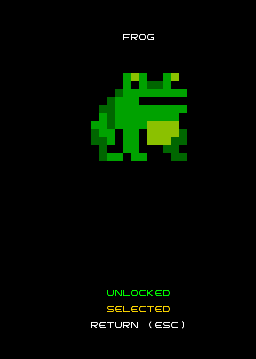</td>
  </tr>
  <tr>
    <td>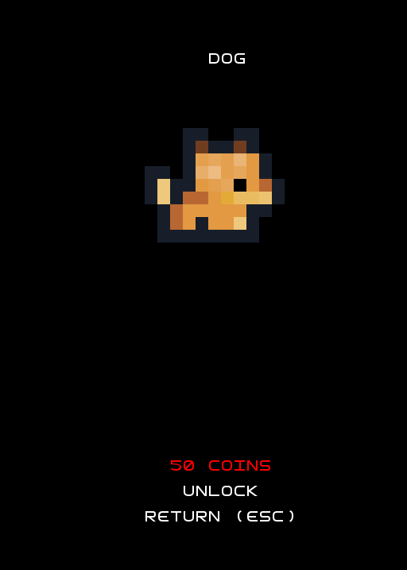</td>
    <td>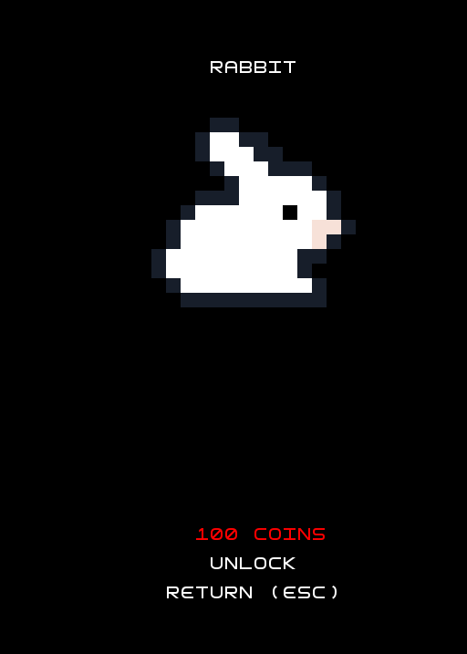</td>
  </tr>
</table>

  <b><i>Fig 6. Shop Interface (Unlocked, Selected, and Locked Skins)</i></b>

 
 

  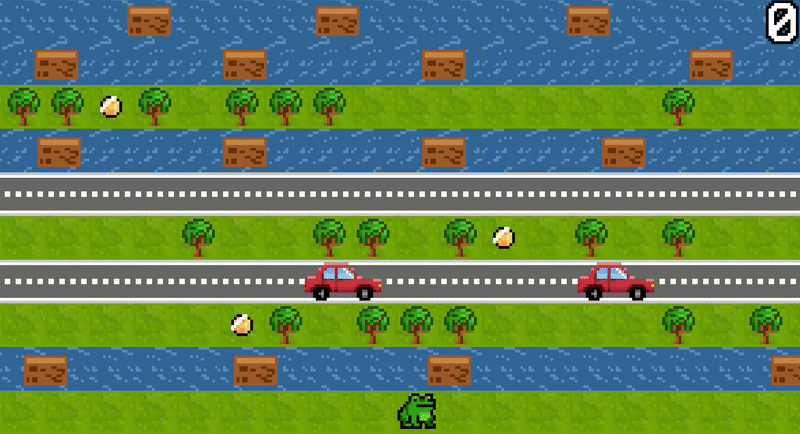

  <b><i>GIF 1. Death Animation</i></b>

## Design

### General Structure
#### Problem in Context:

Following the given recommendations, the project follows an MVC architecture, which divides the game in three parts, which store the logic and data (model), the visual effects (view) and the control of the game (controller).

#### The Pattern:
As described before, regarding the "Architectural Pattern", the project follows the Model-View-Controller style. This ensures the concerns are separate: 
- **Model**: stores the logic and data. Completely independent of user interface.
- **View**: Handles visualization. Reads from model and draws to screen using implemented GUI.
- **Controller**: Processes input and dictates the flow of the game.

#### View Implementation:
The View component is structured to separate the game's visual logic from the specific rendering library used. This is achieved through the following organization:

- **GUI Interface**: Interface of all graphical operations (e.g., `drawText`, `clear`, `refresh`). It serves as an abstraction layer, ensuring that the rest of the application does not depend on a specific library - Application of the Dependency Inversion Principle of SOLID rules. 
- **LanternaGUI**: A concrete implementation of the `GUI` interface **Lanterna** to render graphics in the terminal. It handles the low-level details of interacting with the screen and processing input.
- **Viewer Classes**: Located in `view.game` and `view.menu`, these classes are responsible for rendering specific models. They rely solely on the `GUI` interface, making a future possible change of rendering library easier.

#### Main Consequences:
- **Interchangeability**: Lanterna can easily be replaced simply by creating a new implementation of the `GUI` interface, without modifying the game logic or viewer classes.
- **Testability**: Viewers can be tested in isolation by mocking the `GUI` interface, removing the need for a real graphical environment during testing (as seen in our testing packages).
- **Modularity**: New visual elements can be added by creating new Viewer classes, keeping the rendering logic organized and manageable. 

#### Controller Implementation:
The Controller package is responsible for handling user input and updating the game state. It acts as the bridge between the Model and the View. The main classes of this package do the following: 
- **GameController**: The central controller for the gameplay state. It orchestrates the game loop, managing the player's movement, lane generation, collision detection, and score updates. It delegates specific tasks to specialized sub-controllers.
- **LaneController**: An interface for handling logic specific to different types of lanes.
- **PlayerController**: Dedicated to handling player-specific logic, such as movement validation and position updates based on keyboard input.
- **MenuController**: Manages navigation and interaction within the various menu screens (Main Menu, Shop, Game Over), allowing users to select options and switch states.

This structure ensures that the game logic is modular and that input handling is separated from the core game rules. 

### Screenshot of Controller package

  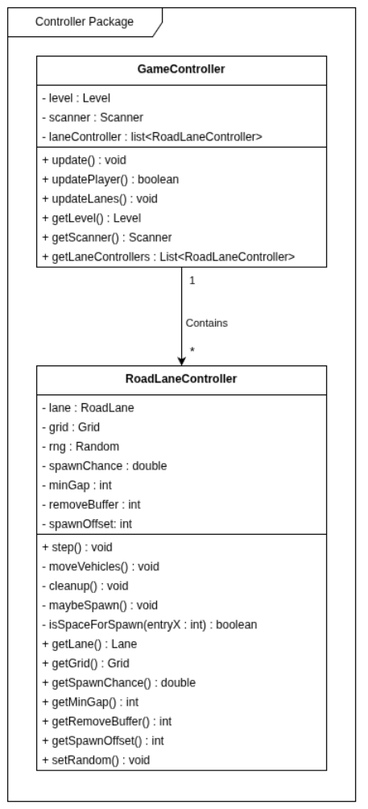

  <b><i>Fig 7. Controller package</i></b>

Regarding the Model, every class uses some sort of Position's attributes, so we decided not to clutter the UML model with Position's connections. The same happened with our Direction enum. Model is centered around Level class which holds the Grid, Lane, and Players. Indirectly, The types of Lane are Conneced to types of entities -> MovableLanes will holf MovableEntities, and StaticLanes will hold StaticEntities, however that connection isnt explicit in code so is not shown in UML diagram. 

### Screenshot of Model package

  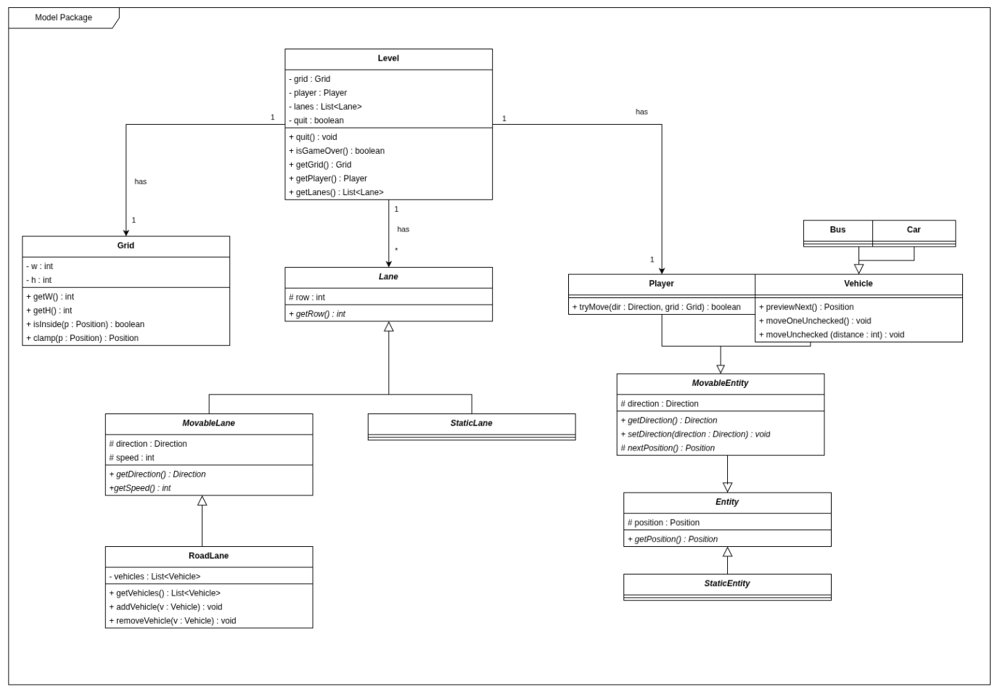

  <b><i>Fig 8. Model package</i></b>

Finally, there is the viewer, which is very simple for now: Simply prints to the console / terminal empty spaces as "." and the entities as their respective symbols.
For now, it doesn't use Lanterna, but it will be implemented in the future.

### Screenshot of View package

  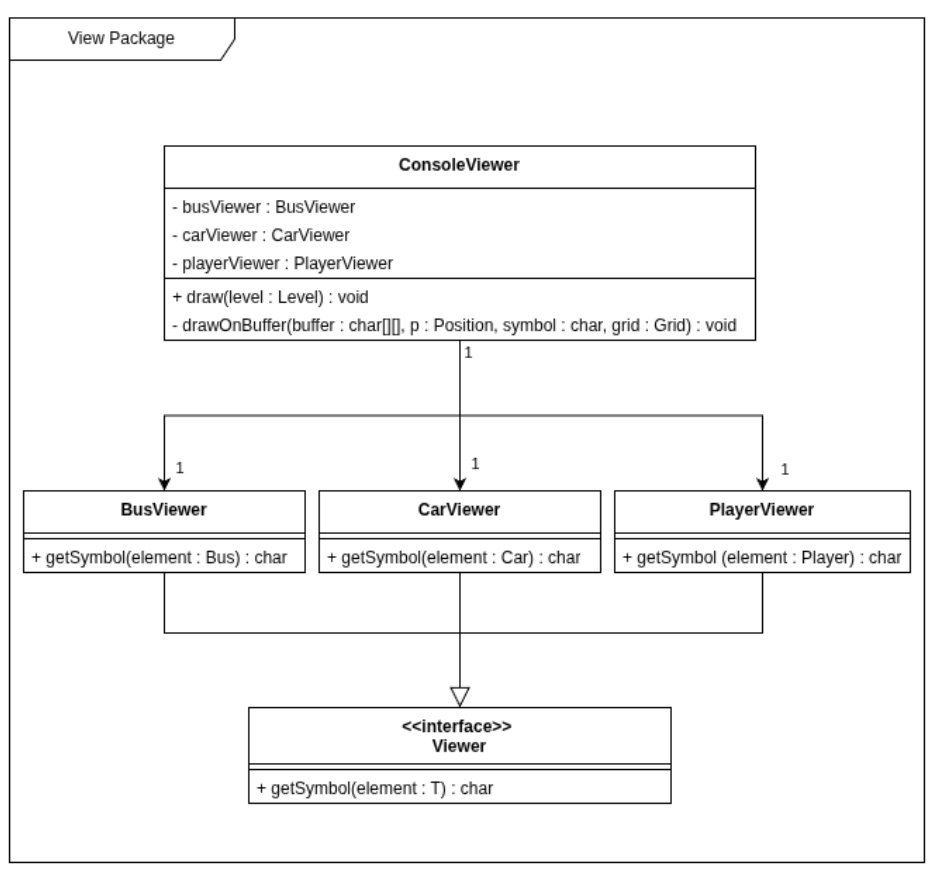

  <b><i>Fig 9. View package</i></b>

#### Problem in Context:
The development of this game and the planning we made has showed that the large variety of distinc entities (vehicles, coins, logs) as well as diferent types of lanes (rivers, roads, safe) would have required a large amount of copied code.

#### Implementation:
In order to solve this, we decided to use abstract classes and interfaces to reduce the amount of copied code.

#### Consequences:

Considering the current state of the game, the amount of abstract classes may seem excessive. This is something that will be changed in the future.

## Known-code smells

Currently the input needs to be done 1 character at a time, and needs "enter" to be pressed to be registered. The view testing is also very basic, as it only tests the console viewer. Using Lanterna in the future will allow for a better input experience, and a more advanced testing system.

There is also the presence of hardcoded values, such as the size of the grid, RoadLanes spawnChance and offset values and more. This is something that will be changed in the future, when logic for increasing difficulty is implemented and the size of different entities is taken into account.
## Testing

### Screenshot of coverage report

  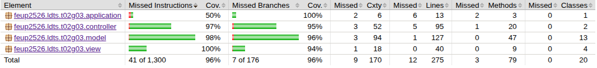

  <b><i>Fig 10. Code coverage screenshot</i></b>

## Self-evaluation

The work was divided in a way that felt fair to every member.
Therefore:

- João Barros: 33.3%
- Miguel Rocha: 33.3%
- Rosa Chilengue: 33.3%