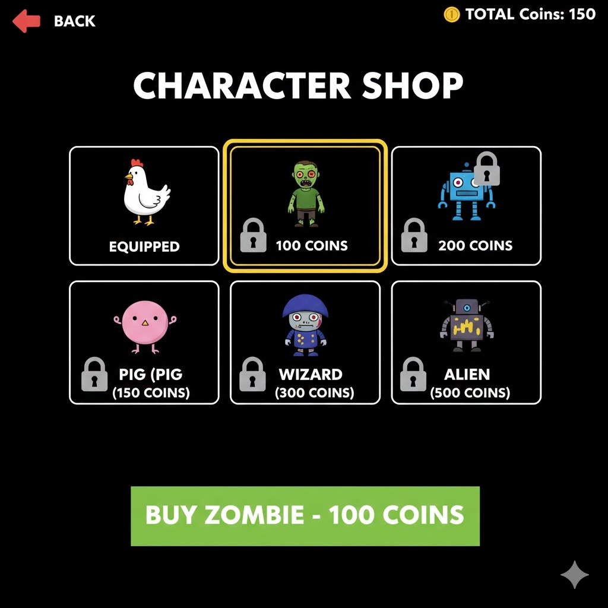

# LDTS_T02_G03 - CROSSY ROADS

## Game Description

Crossy Roads is an endless arcade hopper game where you guide a character across busy roads, train tracks, and rivers while avoiding various obstacles. Your goal is to travel as far as possible without getting hit by vehicles, trains, or falling into the water.
As you progress, the difficulty increases with faster-moving traffic and more challenging patterns.

This project was developed by João Barros (up202406502@edu.fe.up.pt), Miguel Rocha (up202405484@edu.fe.up.pt) and Rosa Chilengue (up202109257@edu.fe.up.pt) for LDTS 2025-26.

## Implemented Features

- **Player control** - The player moves using the keyboard. (WASD)
- **Collision detection** - Collisions between player and car objects are verified.

## Planned Features

- **Connected Menus** - The user will have the capability of browsing through the different menus including in game ones. (Ex: Main Menu, Play, Shop and Pause).
- **Buttons** - Functional and interactive buttons.
- **Mouse and Keyboard control** - The mouse and keyboard inputs will be received through the respective events and interpreted according to the current game state.
- **Score** - Each run will have a score, storing the highest score upon death.
- **Increase of difficulty** - As the game goes on, the difficulty will increase with faster-moving traffic and more challenging patterns.
- **Shop interaction and coins** - The player will be able to buy new skins for the character in the in-game shop, with coins that will be earned by playing.
- **Animations** - Several animations will be incorporated in the game, from the character walking to the movement of the vehicles and the animation of the character dying.
- **Multiple users** - The game will support multiple users, each one with their own highest score and their coins.

## Mockups

The following images try to illustrate some features that we want to implement in the game.
All images were generated by AI - Specifically, Google Gemini 3 Pro implementing Nano Banana Pro. Prompts were continuously changed in order to generate images similar to the ones we had in mind.

  

  <b><i>Fig 1. User Selection Screen</i></b>

  

 
 

  

  <b><i>Fig 2. Main Menu</i></b>

  

 
 

  

  <b><i>Fig 3. Game Screen</i></b>

  

 
 

  

  <b><i>Fig 4. Pause Menu</i></b>

  

 
 

  

  <b><i>Fig 5. Game Over Screen</i></b>

  

 
 

  

  <b><i>Fig 6. Shop Screen</i></b>

## Design

### General Structure
#### Problem in Context:

Following the given recommendations, the project will follow an MVC architecture, which divided the game in three parts, which store the logic and data (model), the visual effects (view) and the control of the game (controller).

#### The Pattern:
As described before, regarding the "Architectural Pattern", the project will follow the Model-View-Controller style. This ensures the concerns are separate: 
- Model: stores the logic and data. Completely independent of user interface.
- View: Handles visalization. Reads from model and draws to screen using implemented GUI.
- Controller: Processes input and dictates the flow of the game.

Our project will also have a "State" pattern, which will allow us to separate the main menu (with options to start gameplay, open shop, switch "skin" and switcv user) from the actual Gameplay state.

#### Implementation:
Our specific implementation will have (we hope) the view separated in 2 main packages. One (the GUI) which will dictate how objects should be drawn, and the other (LanternaGUI) which will hold the logic for the specific GUI.
#### Consequences:
Using these design patterns has the following benefits:
- Ease of implementation of new features.
- Clear separation of concerns.
- Ease of changing the GUI interface. 

#### Problem in Context:

Separation of concerns through the use of the MVC strategy.

#### Implementation:

The project is split into 3 main packages: Model, View and Controller. It also has the application package, which is the main class that starts the game. 
Considering the Controller, our current implementation is centered around the GameController class, which updates the player based on input given by the user, and also updates the Lanes (with their entities) that constitute the game.

### Screenshot of Controller package

  

  <b><i>Fig 7. Controller package</i></b>

Regarding the Model, every class uses some sort of Position's attributes, so we decided not to clutter the UML model with Position's connections. The same happened with our Direction enum. Model is centered around Level class which holds the Grid, Lane, and Players. Indirectly, The types of Lane are Conneced to types of entities -> MovableLanes will holf MovableEntities, and StaticLanes will hold StaticEntities, however that connection isnt explicit in code so is not shown in UML diagram. 

### Screenshot of Model package

  

  <b><i>Fig 8. Model package</i></b>

Finally, there is the viewer, which is very simple for now: Simply prints to the console / terminal empty spaces as "." and the entities as their respective symbols.
For now, it doesn't use Lanterna, but it will be implemented in the future.

### Screenshot of View package

  

  <b><i>Fig 9. View package</i></b>

#### Problem in Context:
The development of this game and the planning we made has showed that the large variety of distinc entities (vehicles, coins, logs) as well as diferent types of lanes (rivers, roads, safe) would have required a large amount of copied code.

#### Implementation:
In order to solve this, we decided to use abstract classes and interfaces to reduce the amount of copied code.

#### Consequences:

Considering the current state of the game, the amount of abstract classes may seem excessive. This is something that will be changed in the future.

## Known-code smells

Instance of in view of movement of vehicles
## Testing

### Screenshot of coverage report

  

  <b><i>Fig 10. Code coverage screenshot</i></b>

## Self-evaluation

The work was divided in a way that felt fair to every member.
Therefore:

- João Barros: 33.3%
- Miguel Rocha: 33.3%
- Rosa Chilengue: 33.3%